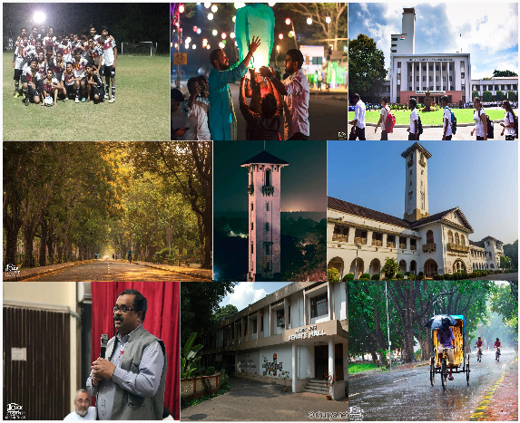
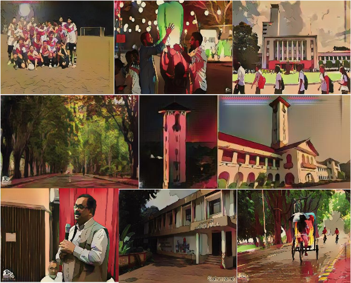

# AnimeGAN

This repository contains my project I did in my Neural Networks & Applications course at IIT Kharagpur.\
The developed GAN architecture is used to transoform real-world images into their animated variants

## Results

These are some of the real images taken from IIT Kharagpur campus.

These are the transformed animated variants of the real images.

## Requirements
PyTorch
OpenCV
